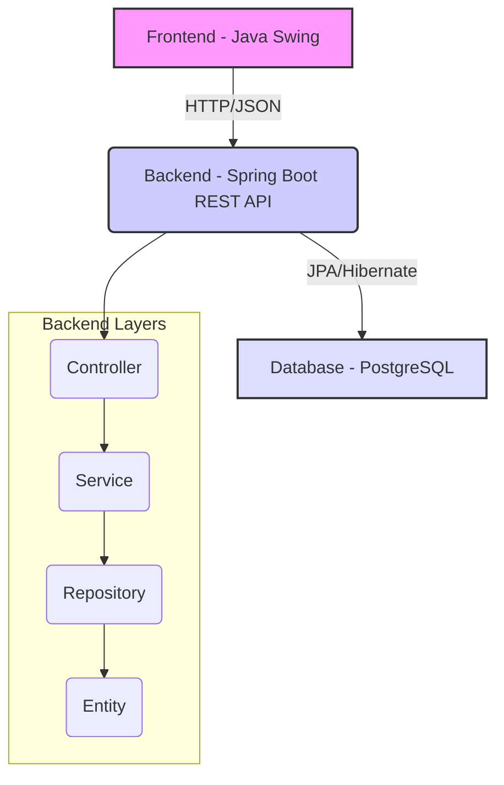

# ⛽ PDV Posto de Combustível

[](https://www.oracle.com/java/technologies/javase/jdk17-archive-downloads.html)
[](https://spring.io/projects/spring-boot)
[](https://www.postgresql.org/)
[](https://docs.oracle.com/javase/8/docs/technotes/guides/swing/)
[](LICENSE)
[](https://github.com/GilvanPedro/pdv-posto--de-combustivel)

Sistema de Ponto de Venda (PDV) para Posto de Combustível, desenvolvido como um projeto acadêmico completo, utilizando **Java** com **Spring Boot** para o Backend (API REST) e **Java Swing** para o Frontend (Interface Gráfica).

## 📋 Índice

*   [Sobre o Projeto](#-sobre-o-projeto)
*   [Funcionalidades Chave](#-funcionalidades-chave)
*   [Arquitetura e Padrões](#-arquitetura-e-padrões)
*   [Tecnologias Utilizadas](#-tecnologias-utilizadas)
*   [Pré-requisitos](#-pré-requisitos)
*   [Instalação e Configuração](#-instalação-e-configuração)
*   [Como Usar](#-como-usar)
*   [Documentação da API](#-documentação-da-api)
*   [Estrutura do Projeto](#-estrutura-do-projeto)
*   [Contribuindo](#-contribuindo)
*   [Licença](#-licença)
*   [Contato](#-contato)

## 🎯 Sobre o Projeto

O **PDV Posto de Combustível** é uma solução de gerenciamento robusta, focada em demonstrar a aplicação de boas práticas de desenvolvimento de software, como a **Programação Orientada a Objetos (POO)**, **Arquitetura REST** e diversos **Padrões de Projeto**.

O sistema é dividido em duas partes principais:

1.  **Backend (API REST):** Construído com **Spring Boot**, responsável pela lógica de negócios, persistência de dados e exposição dos serviços via HTTP.
2.  **Frontend (Interface Gráfica):** Desenvolvido em **Java Swing**, fornecendo uma interface de usuário moderna e intuitiva que se comunica com o Backend via requisições HTTP/JSON.

### ✨ Destaques do Projeto

| Recurso | Descrição |
| :--- | :--- |
| **Arquitetura** | Separação clara entre Frontend (Swing) e Backend (Spring Boot) com comunicação RESTful. |
| **Segurança** | Sistema de Login e Cadastro com autenticação e registro de acessos. |
| **Persistência** | Utilização de **PostgreSQL** com **Spring Data JPA** e **Hibernate** para gerenciamento de 7 entidades. |
| **Qualidade** | Implementação de validações de dados (CPF, CNPJ, campos obrigatórios) e tratamento de exceções global. |
| **Documentação** | API documentada automaticamente com **Swagger/OpenAPI**. |

## 🚀 Funcionalidades Chave

O sistema oferece um **CRUD (Create, Read, Update, Delete) completo** para as seguintes entidades, além de um robusto sistema de autenticação:

### 🔐 Autenticação e Acesso

*   **Login e Cadastro:** Autenticação de usuários com gerenciamento de sessão.
*   **Registro de Acessos:** Histórico detalhado de logins no banco de dados.

### 📊 Gerenciamento de Entidades

| Entidade | Descrição |
| :--- | :--- |
| **👥 Pessoas** | Cadastro de clientes e funcionários, com suporte para Pessoa Física (CPF) e Jurídica (CNPJ) e validação de documentos. |
| **📦 Produtos** | Gerenciamento de itens e combustíveis vendidos no posto. |
| **💰 Preços** | Controle e histórico de preços de venda dos produtos. |
| **💵 Custos** | Registro e controle de despesas e custos operacionais. |
| **📦 Estoques** | Gestão de inventário, quantidades disponíveis e movimentações de estoque. |
| **🔑 Acessos** | Administração de usuários e permissões do sistema. |
| **📞 Contatos** | Cadastro de informações de contato (telefones, e-mails). |

## 🏗️ Arquitetura e Padrões

O projeto segue uma arquitetura em camadas bem definida, promovendo a separação de responsabilidades e a manutenibilidade do código.

### Diagrama de Arquitetura



### Padrões de Projeto

*   **MVC (Model-View-Controller):** Aplicado na estrutura do Frontend Swing.
*   **DTO (Data Transfer Object):** Utilizado para transferir dados entre as camadas do Backend e a comunicação com o Frontend.
*   **Repository Pattern:** Abstração da camada de persistência de dados.
*   **Service Layer Pattern:** Camada de lógica de negócios, isolando-a dos Controllers.
*   **Dependency Injection:** Gerenciamento de dependências pelo Spring Framework.
*   **RESTful API:** Implementação de uma interface de comunicação padronizada e sem estado.

## 🛠️ Tecnologias Utilizadas

| Categoria | Tecnologia | Versão | Descrição |
| :--- | :--- | :--- | :--- |
| **Linguagem** | Java | 17+ | Linguagem principal de desenvolvimento. |
| **Backend** | Spring Boot | 3.2.5 | Framework para construção da API REST. |
| **Frontend** | Java Swing | N/A | Toolkit para a Interface Gráfica (GUI). |
| **Banco de Dados** | PostgreSQL | 15+ | Sistema de Gerenciamento de Banco de Dados Relacional (SGBDR). |
| **Persistência** | Spring Data JPA / Hibernate | N/A | Mapeamento Objeto-Relacional (ORM). |
| **Documentação** | Swagger/OpenAPI | 2.3.0 | Geração automática de documentação da API. |
| **Build Tool** | Maven | 3.8+ | Gerenciamento de dependências e ciclo de vida do projeto. |
| **Serialização** | Jackson | N/A | Processamento de JSON no Frontend. |

## 📦 Pré-requisitos

Certifique-se de ter as seguintes ferramentas instaladas em sua máquina:

*   **Java JDK 17+**: [Download Oficial](https://www.oracle.com/java/technologies/javase/jdk17-archive-downloads.html)
*   **Maven 3.8+**: [Instalação](https://maven.apache.org/install.html)
*   **PostgreSQL 15+**: [Download Oficial](https://www.postgresql.org/download/)
*   **IDE (Recomendado)**: IntelliJ IDEA ou Eclipse.

Para verificar suas instalações, execute no terminal:

```bash
java -version
mvn -version
psql --version
```

## ⚙️ Instalação e Configuração

Siga os passos abaixo para configurar e executar o projeto localmente.

### 1️⃣ Clonar o Repositório

```bash
git clone https://github.com/GilvanPedro/pdv-posto--de-combustivel.git
cd pdv-posto--de-combustivel
```

### 2️⃣ Configurar o Banco de Dados

Crie um banco de dados PostgreSQL com o nome `pdvpostocombustivel`.

**Via SQL:**

```sql
CREATE DATABASE pdvpostocombustivel;
```

### 3️⃣ Configurar Credenciais do Banco de Dados

1.  Navegue até o diretório de recursos do Backend: `pdv-posto--de-combustivel/pdv-posto-combustivel/src/main/resources/`
2.  Se o arquivo `application.properties` não existir, copie o arquivo de exemplo:
    ```bash
    cp application.properties.example application.properties
    ```
3.  Edite o arquivo `application.properties` e substitua `SUA_SENHA_AQUI` pela senha do seu usuário PostgreSQL:

    ```ini
    # Exemplo de configuração
    spring.datasource.url=jdbc:postgresql://localhost:5432/pdvpostocombustivel
    spring.datasource.username=postgres
    spring.datasource.password=SUA_SENHA_AQUI
    ```

### 4️⃣ Executar o Backend (API REST)

O Backend será executado na porta padrão `8082`.

**Via Terminal (Maven):**

```bash
cd pdv-posto-combustivel
mvn spring-boot:run
```

**URL Base da API:** `http://localhost:8080`

### 5️⃣ Executar o Frontend (Java Swing)

O Frontend deve ser executado *após* o Backend estar ativo.

**Via IDE (IntelliJ/Eclipse):**

1.  Abra o projeto `JavaPoo-Front-End-main` na sua IDE.
2.  Localize a classe principal: `src/main/java/br/com/PdvFrontEnd/view/MainApp.java`
3.  Execute o método `main()` desta classe.

A interface gráfica será iniciada e tentará se conectar à API REST em `http://localhost:8080`.

## 💻 Como Usar

### Primeiro Acesso (Cadastro Inicial)

Na primeira execução do Frontend, o sistema detectará a ausência de usuários e o direcionará automaticamente para a tela de **CADASTRO**.

1.  Preencha os dados solicitados.
2.  Clique em "Cadastrar".
3.  Você será redirecionado para a tela de **LOGIN**.

### Acessos Subsequentes

1.  Execute o **Backend** e o **Frontend**.
2.  Na tela de **LOGIN**, insira as credenciais cadastradas.
3.  A tela de **GERENCIAMENTO** será exibida, permitindo o acesso a todas as funcionalidades (Pessoas, Produtos, Estoques, etc.).

## 📖 Documentação da API

A documentação da API REST é gerada automaticamente utilizando **Swagger/OpenAPI** e pode ser acessada no seu navegador após a execução do Backend:

**URL da Documentação:** `http://localhost:8080/swagger-ui.html`

Esta interface permite visualizar todos os *endpoints* disponíveis, seus parâmetros de requisição e respostas esperadas.

## 📂 Estrutura do Projeto

O repositório está organizado em dois módulos principais:

```
pdv-posto--de-combustivel/
├── pdv-posto-combustivel/         # Módulo Backend (Spring Boot)
│   ├── src/main/java/             # Código-fonte Java do Backend
│   ├── src/main/resources/        # Arquivos de configuração (application.properties)
│   └── pom.xml                    # Dependências e configuração do Maven
├── JavaPoo-Front-End-main/        # Módulo Frontend (Java Swing)
│   ├── src/main/java/             # Código-fonte Java do Frontend (Views, Services)
│   └── pom.xml                    # Dependências do Maven para o Frontend
├── _docs_e_scripts/               # Documentação e scripts auxiliares
├── COMO_CONFIGURAR_E_TESTAR.md    # Guia de configuração (será substituído por este README)
└── README.md                      # Este arquivo
```

## 🤝 Contribuindo

Contribuições são bem-vindas! Se você deseja aprimorar este projeto, siga os passos:

1.  Faça um **Fork** do projeto.
2.  Crie uma *branch* para sua funcionalidade (`git checkout -b feature/nova-funcionalidade`).
3.  Faça o *commit* de suas alterações (`git commit -m 'feat: Adiciona nova funcionalidade X'`).
4.  Faça o *push* para a *branch* (`git push origin feature/nova-funcionalidade`).
5.  Abra um **Pull Request**.

## 📄 Licença

Este projeto está licenciado sob a Licença **MIT**. Consulte o arquivo [LICENSE](LICENSE) para mais detalhes.

## 📧 Contato

*   **Autor:** Gilvan Pedro
*   **GitHub:** [GilvanPedro](https://github.com/GilvanPedro)

---
*Este README foi aprimorado por Manus AI.*
